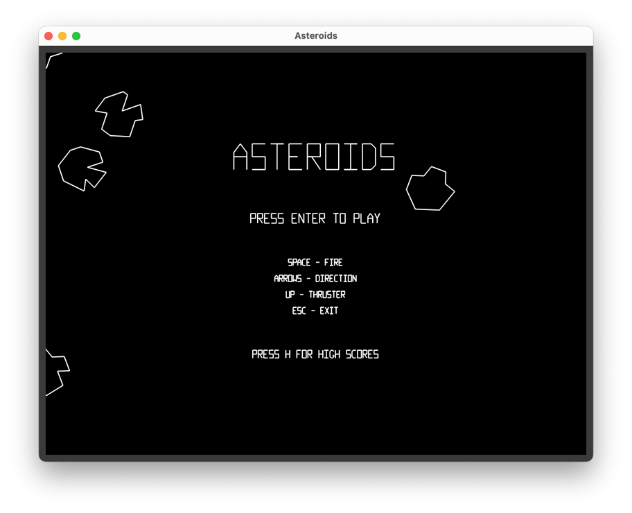

# Asteroids

Be thrilled by this high fidelity reproduction of Atari's 1979 classic, Asteroids!

This is a tidied up version of an Asteroids clone that I wrote over the course of several weekends, as a way to procrastinate while studying for exams. The aim was to get the game running quickly, taking a 'less-is-more' approach. Graphics were implemented using legacy OpenGL, while window management, audio and input were all handled by SDL.

## Ports

This project has also been ported to the web using Emscripten, which I wrote about in [this blog post](https://tristanpenman.com/blog/posts/2018/01/08/porting-an-asteroids-clone-to-javascript/), and later to the venerable Nintendo 64. The code for the N64 version can be found under [n64](./n64).

## Demo

A playable demo can be found [here](https://tristanpenman.com/demos/asteroids).

If you want to try the N64 version (using either an emulator or a flash-cast such as the Everdrive 64) you can download the ROM [here](https://tristanpenman.com/demos/asteroids/asteroids.n64).

## Dependencies

* SDL2
* SDL_Mixer2
* CMake
* Emscripten (for web builds)

## Build

### macOS and Linux

The project currently depends on SDL2 and SDL2_mixer, and builds are handled by CMake. Once those dependencies are installed (e.g. using Homebrew or apt), native macOS and Linux builds are relatively simple:

    mkdir build
    cd build
    cmake ..
    make

### Windows

The project's CMake configuration can also be used to generate Visual Studio project files. However, you will need to extract the archives in [thirdparty](./thirdparty) before you can do this.

Once those archives have been extracted, CMake GUI should be able to generate a VS solution using the default configuration.

### Emscripten

The project can also be compiled to Javascript using Emscripten.

    mkdir embuild
    cd embuild
    emcmake cmake ..
    emmake make
    emrun asteroids.html

Emscripten builds are only supported on Linux and macOS systems.

## License

This code has been released under the MIT License. See the [LICENSE](LICENSE) file for more information.

### Assets

Game assets are under copyright by Atari.

The graphics and audio that have been reproduced here are all used in good faith. The clone is intentionally incomplete, so as to not detract from the value of any Atari releases of the game.
